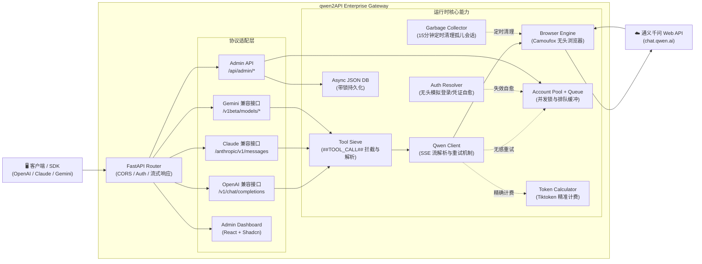

# qwen2API Enterprise Gateway

将通义千问（chat.qwen.ai）网页版 Web 对话能力转换为 OpenAI、Claude 与 Gemini 兼容 API。后端为 **Python (FastAPI) 全量实现** ，前端为基于 React + Shadcn 构建的管理台。

## 架构概览

qwen2API 2.x（企业级模块化版）



- **后端**：Python (FastAPI + Uvicorn + Camoufox)
- **前端**：React + Vite + Shadcn UI 管理台
- **部署**：跨平台 Python 脚本运行、Docker / Docker Compose 容器化部署

### 2.X 底层架构调整（相较旧版本）

- **模块化解耦**：将原单文件脚本拆分为 `core/`、`services/`、`api/` 路由层，极大提升可维护性。
- **多协议原生适配**：不仅兼容 OpenAI，还原生提供对 Anthropic (`/anthropic/v1/messages`) 与 Gemini (`/v1beta/models/*`) 接口的转换。
- **工具调用绝对控制 (Tool Sieve)**：针对千问网页版缺乏原生 Function Calling 的缺陷，植入底层 Prompt 劫持与流式文本剥离（`##TOOL_CALL##`），在全协议下实现工具调用支持。
- **无感容灾重拨**：当某个上游账号被限流（Rate Limit）或 Token 失效时，底层拦截请求并自动更换健康账号重试。
- **凭证自愈引擎**：遇到 401 权限问题时，`Auth Resolver` 会自动拉起独立浏览器后台模拟登录并提取新 Token，实现无人值守自愈。
- **并发防洪缓冲堤**：面对瞬时高并发，请求自动进入等待队列，超过等待阈值优雅返回 `429 Too Many Requests`，保护浏览器引擎免于崩溃。
- **冷酷的精算师**：内嵌 `tiktoken` 强制计算 Prompt 与 Completion 的精确 Token，实现对下游用户的精准额度扣减。
- **后台清道夫 (Garbage Collector)**：内建后台守护进程，每 15 分钟自动巡检并焚烧由 API 产生的孤儿会话，防止账号记录堆积。
- **深度运维探针**：提供标准的 Kubernetes 级探针（`/healthz`、`/readyz`）与底层故障请求的快照捕获。
- **Shadcn 纯后台面板**：前端重构为极简暗黑风仪表盘，提供全局并发监控、上游账号状态、下游 Token 分发与额度管理。

## 核心能力

| 能力 | 说明 |
|---|---|
| OpenAI 兼容 | `POST /v1/chat/completions`、`POST /v1/embeddings` (伪 Hash 模拟，适配 OpenWebUI) |
| Claude 兼容 | `POST /anthropic/v1/messages` |
| Gemini 兼容 | `POST /v1beta/models/{model}:streamGenerateContent` |
| 多账号并发轮询 | 支持多账号并发执行，内建负载均衡与失败剔除机制 |
| 无感容灾重试 | 上游账号不可用时自动切换健康账号重新发起请求 |
| 凭证自动刷新 | `Auth Resolver` 捕获 Token 失效自动模拟登录自愈 |
| 并发队列控制 | 引擎级并发槽位 + 等待队列，动态防洪 |
| Tool Calling | 跨协议统一支持，Prompt 级劫持与 `Tool Sieve` 增量拦截，防止模型代码块泄漏 |
| Token 精确计费 | 集成 `tiktoken` (cl100k_base) 实时计算消耗，支持租户额度控制 |
| 浏览器指纹伪装 | 基于 `camoufox` 引擎，绕过常规自动化检测，保障请求稳定性 |
| Admin API | 提供账号增删、引擎状态查询、下游用户 Token 签发与额度管理 |
| WebUI 管理台 | 基于 Shadcn 构建的极暗风数据大盘，直观掌控全链路运行状态 |
| 运维与部署 | 探针闭环、完善的 Dockerfile 与 docker-compose 支持 |

## 模型支持

接口内置了完善的模型名称映射机制，主流调用参数均可被安全路由至千问最佳模型：

| 客户端传入模型名 | 实际映射目标模型 |
|---|---|
| `gpt-4o` / `gpt-4-turbo` / `o1` / `o3` | `qwen3.6-plus` |
| `gpt-4o-mini` / `gpt-3.5-turbo` / `o1-mini` | `qwen3.5-flash` |
| `claude-3-5-sonnet` / `claude-opus-4-6` | `qwen3.6-plus` |
| `claude-3-haiku` | `qwen3.5-flash` |
| `gemini-2.5-pro` | `qwen3.6-plus` |
| `deepseek-chat` / `deepseek-reasoner` | `qwen3.6-plus` |

## 快速开始

### 方式一：Docker / Docker Compose (推荐)

项目内置了多阶段构建的 Dockerfile，前后端分离构建并打包为统一网关。

1. **准备环境**
```bash
git clone https://github.com/YuJunZhiXue/qwen2API.git
cd qwen2API
```

2. **启动服务**
```bash
docker-compose up -d
```
启动后，映射宿主机的 `8080` 端口。你可以访问 `http://localhost:8080` 进行 API 调用。前端控制台构建产物同样托管于后端服务中。

### 方式二：本地运行

1. **安装依赖**
```bash
cd backend
pip install -r requirements.txt
python -m camoufox fetch  # 下载浏览器内核

cd ../frontend
npm install
cd ..
```

2. **一键点火启动**
```bash
python start.py
```

启动后系统将自动唤醒：
- **管理中枢 (Frontend)**：`http://localhost:5173`
- **API 接口 (Backend)**：`http://localhost:8080`

## 配置说明

系统核心状态存储于 `data/` 目录下（由程序自动生成与维护）：
- `data/accounts.json`：存放上游千问账号的登录凭证与状态。
- `data/users.json`：存放签发给下游调用的 API Key 及 Token 消耗统计。

## 免责声明

本项目仅供个人学习与技术研究使用，旨在探讨浏览器自动化与 API 接口封装技术。
1. 本项目与相关官方（如阿里云、通义千问等）无任何关联，并非官方提供的 API。
2. 请勿将本项目用于任何商业用途或高并发的生产环境中，因滥用本项目导致的一切账号封禁、数据丢失或法律纠纷，由使用者自行承担，本项目及开发者不承担任何责任。
3. 若本项目的存在侵犯了相关方的合法权益，请提交 Issue，我们将配合妥善处理或删除本项目。
